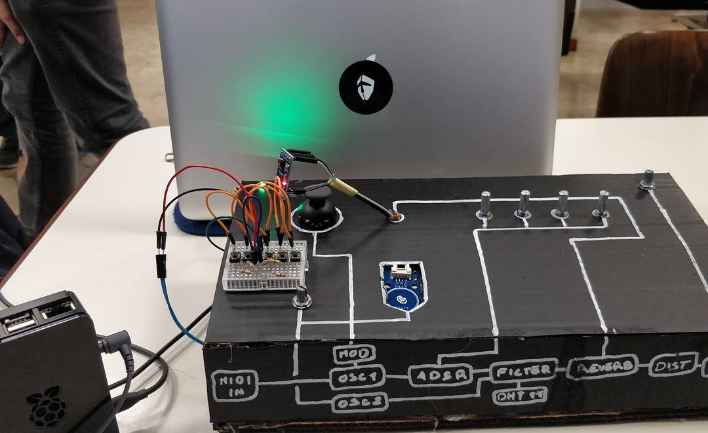

# DAMS_01
DAMS_01 is a digital synthesizer developed in PureData.
The aim of this project is to create a working synthesizer for live performances wich could be modified every time to create new sounds for different situations.
Its main feature is that it uses the surrounding environment to controll some parameter of the synthesis.

## Components
* Raspberry PI3: this will be used for running PureData and comunicating with the arduino.;
* Arduino UNO: used to analize and elaborate the data provided by the sensors and send it to the PD patch;
  ### Sensors:
  * RGB Led;
  * ADXL 345;
  * Touch sensor;
  * LDR;
  * DHT11;
  * Analog Thumb Joystic;
  * Multiplexer CD4067BE;
  * 5x potentiometer 10kΩ;
  * 5x momentary buttons;

## Problems
  * The first problem was the lack of analog inputs available on the arduino, to solve this i've used a multiplexer wich uses       only one analog input to read up to 16 analog lines, it's also been used a technique to get data from five different buttons with just one analog input.
  * The second, and biggest problem was to send data over serial without writing a new serializing protocol, i've choose to use [Firmata](http://firmata.org), but that was too simple for my needs, so i came up writing Firmata_Extended wich is an extension of the code StandardFirmata provided by the examples of the arduino software simulates more analog pins on the board and sends any kind of number, mapped from 0 to 1023, as if it is read by the board.

## Links
  * Firmata: http://firmata.org
  * PureData: https://puredata.info
  * About multiplexer: https://cityos.io/tutorial/1958/Use-multiplexer-with-Arduino
  * About multiple buttons: http://www.instructables.com/id/How-to-access-5-buttons-through-1-Arduino-input/
